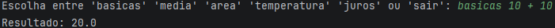

# Exercícios em Java

## Uso de: 
| scanner | if/else | split | parseDouble | switch | while | for | try/catch | stack |
|---------|---------|-------|-------------|--------|-------|-----|-----------|-------|

## Criação de uma calculadora capaz de:
  * Calculos Basicos: + - * /
  * Media Aritmetica
  * Calculo de Area e Raio
  * Conversão de Graus: C ⇄ F
  * Juros Simples e Compostos

### Como utilizar?

Fiz essa calculadora para atender exatamente aquilo que voe precisa, por isso para usá-la você também deve ser direto.
Exitem nela uma série de operações onde a lógica foi totalmente otimizada e direcionada por palavras especificas qual,
especificarei na tabela a seguir:

| Tipo de operação          |                                                   PALAVRA-CHAVE |            OPERADOR           |  
|:--------------------------|----------------------------------------------------------------:|:-----------------------------:|
| Contas Basicas            |                                        basicas                ➜ |            + - * /            |
| Media Aritmetica          |                                        media                  ➜ |           n1 n2 n3            |
| Area                      |      area retangulo➜   area circulo➜   area triangulo ➜ |   n1 n2 n1   n1 n2    |  
| Conversão de Graus        |    temperatura em f   ➜                   temperatura em c➜ | Fahrenheitº      Celsius° |
| Juros simples e Compostos |                     juros simples ➜   juros composto      ➜ |    n1 n2 n3   n1 n2 n3    |

###### Obs: Use sempre a palavra-chave e depois o operador com a formatação correta, para evitar falhas, ou mensagens de erro. Como será demonstrado no exemplo abaixo:

# Outras Funcionalidades
## Ferramentas
 * Encurtador de URLs(Ainda não útil, funciona apenas local).